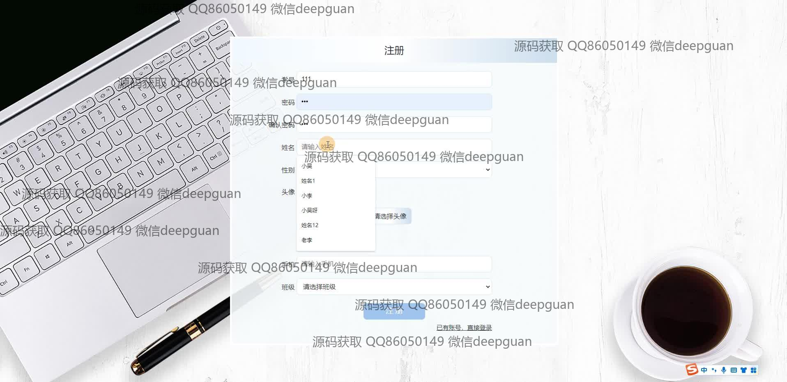
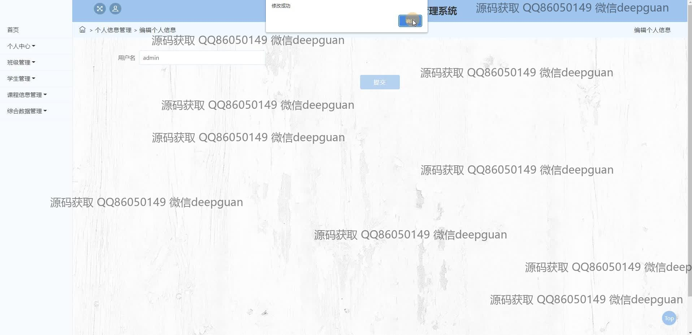
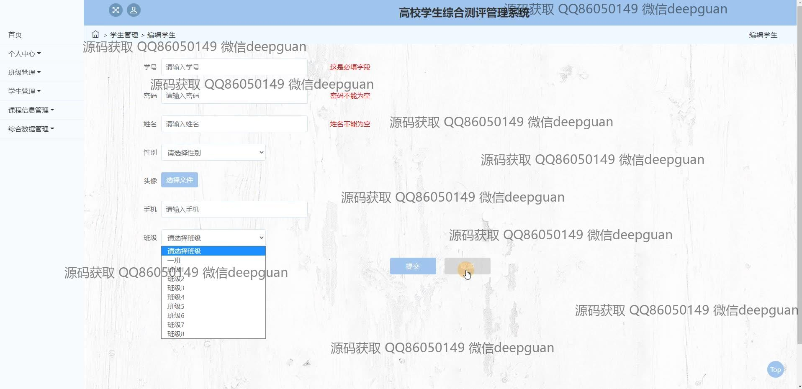
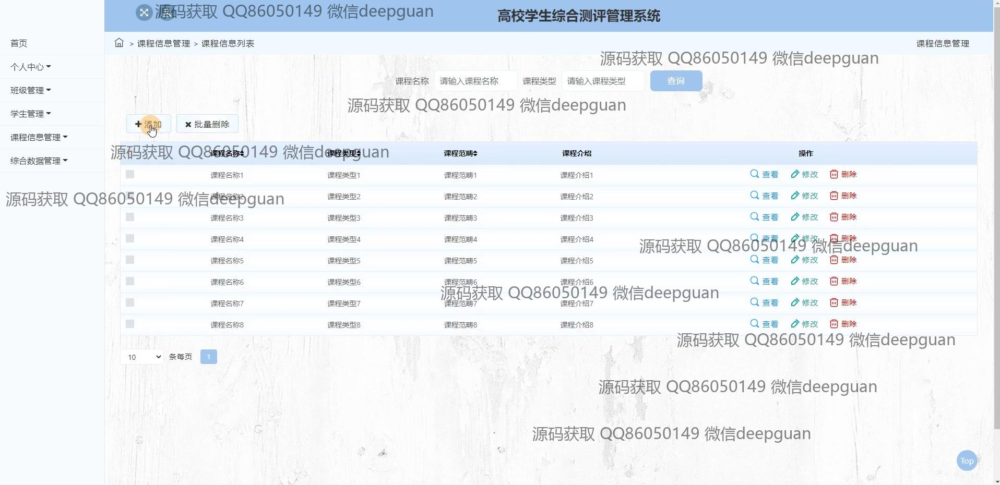
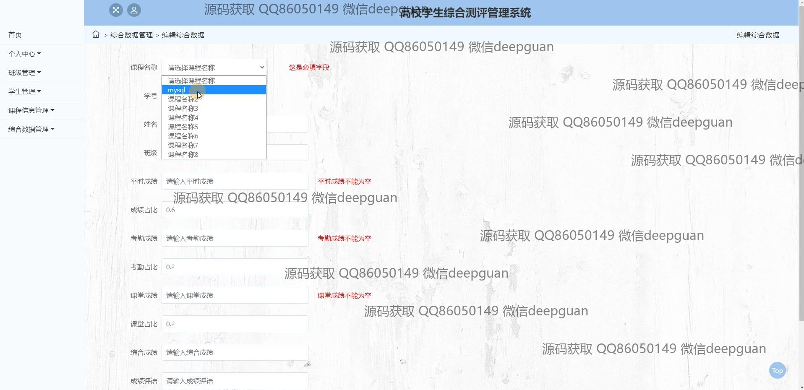
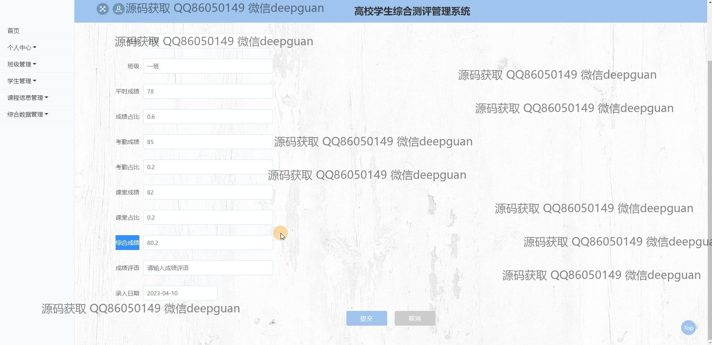
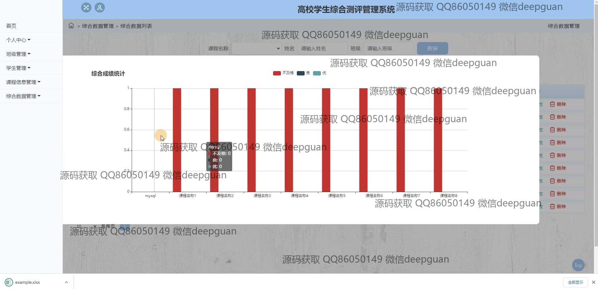
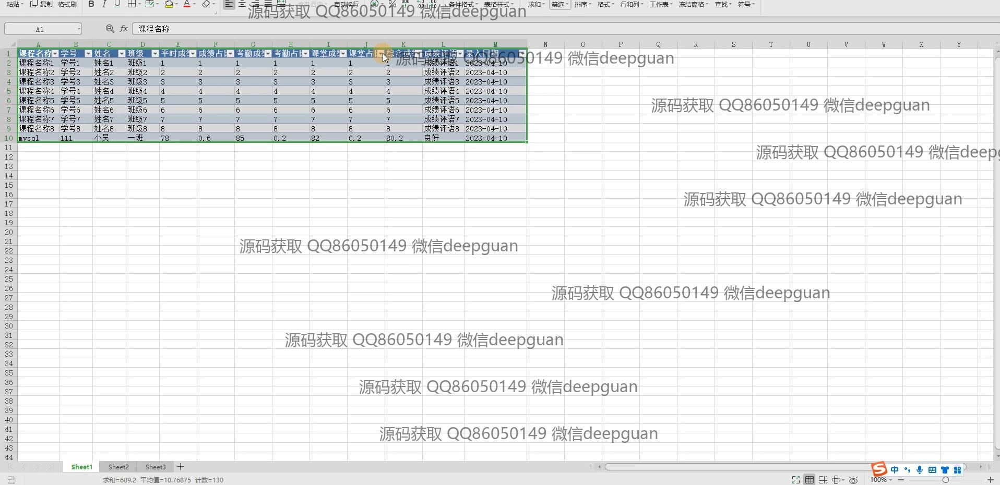
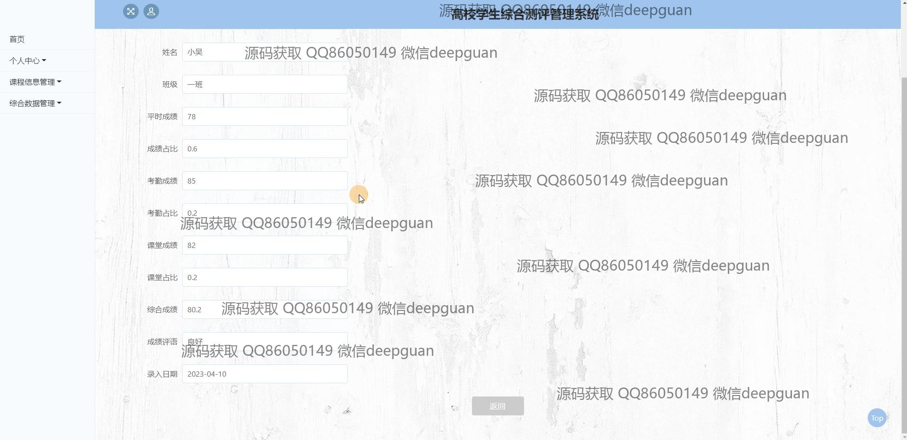

<h1 align="center">高校学生综合测评管理系统-</h1>

## 简介
高校学生综合测评管理系统：角色分为管理员、用户；提供学生信息管理、成绩录入与统计、课程信息管理、综合数据分析、个性化权限管理等功能，支持可视化展示和数据导出。    --计算机毕业设计源码；毕设源码；java毕业设计源码

## 联系方式

<h3 align="center">获取完整代码与数据库文件 + 微信：deepguan QQ: 86050149 QQ群: 783742310</h3>

<h3 align="center">可帮忙远程部署 包运行成功！提供远程部署、修改代码、设计文档指导、代码讲解等服务！</h3>

## 功能介绍（完整见运行截图）
管理员：基本功能包括用户的注册、登录、信息管理，以及学生和班级管理。课程信息管理模块支持课程的查看、修改、删除和添加，提供了搜索和筛选功能。成绩管理方面，管理员可以录入、查询、统计和分析学生的综合成绩，并生成成绩评估报告。系统支持访问权限控制，以确保数据的安全和隐私。

教师：可以通过系统进入班级管理，上传学生成绩和考勤信息，并进行平时成绩和课堂表现的统计和分析。教师可根据不同课程在成绩管理中查询和调整成绩录入，以及生成和查看学生成绩的统计报表。

学生：注册和登录后，可在个人中心查看和编辑个人信息，了解自己的课程表、成绩记录及综合评价。学生还可以查看课程介绍及自身成绩的详细评语与数据。

系统用户：导航栏提供首页、个人中心、课程信息、班级管理、学生管理和综合数据管理等功能，支持按需求自定义信息录入和统计分析。用户界面简洁直观，包含成绩录入、评估管理等模块，配合图表和评价功能，为所有用户角色提供完善的数据服务和支持。

## 运行截图

本代码来源于网络,仅供学习参考使用!

